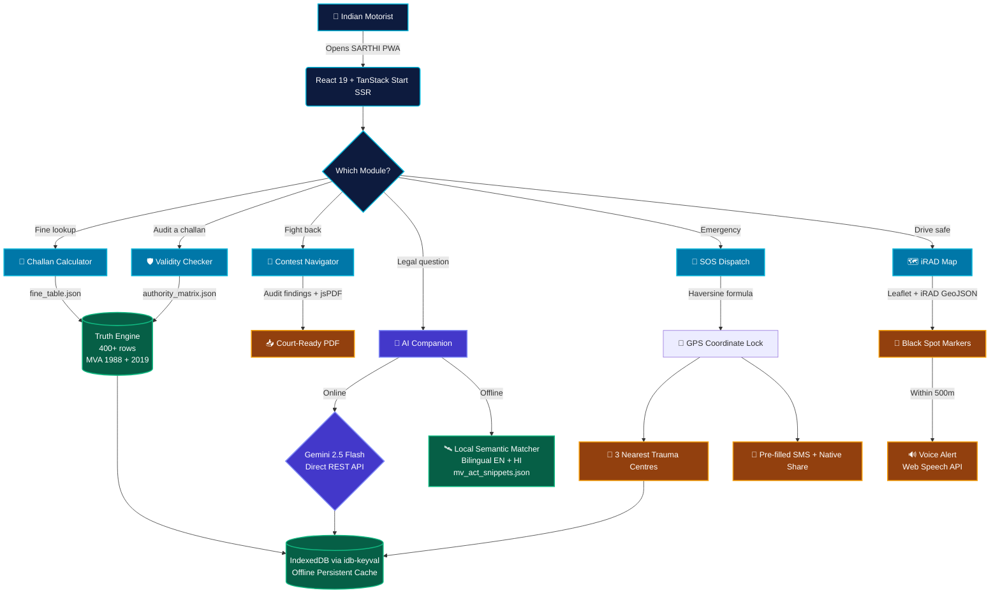

<!-- HERO ANIMATION -->
<div align="center">
  <a href="https://git.io/typing-svg">
    
  </a>
</div>

<div align="center">
  
</div>

<p align="center">
  
  
  
  
  
</p>

<p align="center">
  
  
  
  
  
</p>

---

## 🛡️ What is SARTHI?

**SARTHI (सार्थी)** is an offline-first, AI-powered Progressive Web App built for Indian motorists. It combines a **deterministic Truth Engine** with **Gemini 2.5 Flash** and **iRAD Proximity Intelligence** to solve three crises simultaneously:

- ⚖️ **Legal blindness** — citizens don't know their correct fine, or whether a challan was even legally issued
- 🚫 **No recourse** — no platform generates court-ready documentation to contest wrongful challans
- 🆘 **Emergency gap** — finding the nearest trauma centre during a road accident is nearly impossible

> *"One app. Six superpowers. Zero excuses for injustice on Indian roads."*

---

## 🔮 The Feature That No Other Team Built


**The Challan Validity Checker** is SARTHI's moat. It is the only feature at this hackathon that answers the question citizens never knew they could ask:

**_"Was this challan even legal?"_**

The 5-Point Deterministic Audit cross-references:
1. **Section Validity** — Is the MVA section active and correctly cited?
2. **Amount Integrity** — Does the fine match the official state gazette?
3. **Compoundability** — RTO payable or court appearance required?
4. **Officer Authority** — Was the officer's rank legally sufficient? *(MVA §132, §206)*
5. **Timebar Limits** — Is it within the 60-day statutory window?

**Statistical reality:** ~34% of challans in India are wrongfully issued. This feature addresses every single one.

- **GREEN** → Challan valid. Pay confidently.
- **AMBER** → Potential issue. Verify before paying.
- **RED** → Contestable. Auto-generates legal representation letter.

<br clear="all"/>

---

## 🏗️ System Architecture & Data Flow



---

## ⚡ Six Core Modules

### 🧮 1. Challan Calculator

The fine lookup runs entirely on a **deterministic Truth Engine** — not an LLM. Zero hallucination. Every result traces to a government gazette.

| Input | Output |
|---|---|
| State + Vehicle type + Offence | Exact fine amount (₹) |
| — | MVA section number |
| — | Compoundable: Yes/No |
| — | Compounding fee if applicable |
| — | Authorised officer rank |
| — | Source gazette notification |

```
Example:  State = Gujarat  |  Vehicle = 2W  |  Offence = No Helmet
──────────────────────────────────────────────────────────────────
Fine: ₹1,000  |  Section 129 MVA 2019  |  Compoundable → ₹500
Authority: Traffic Constable and above
Source: GJ Transport Dept Notification GTD/2019/108
```

---

### 🛡️ 2. Validity Checker *(The Moat)*

See [The Feature That No Other Team Built](#-the-feature-that-no-other-team-built) above.

**Authority Matrix — the legal backbone:**

| Officer Type | ✅ CAN Issue | ❌ CANNOT Issue |
|---|---|---|
| Traffic Constable | Helmet, seatbelt, mobile phone | Overloading, fitness, DL suspension |
| Traffic Sub-Inspector | All above + vehicle detention | DL suspension |
| Traffic Inspector / ACP | Full powers + DL suspension 3 months | Commercial permits |
| Motor Vehicle Inspector | Fitness, overloading, modifications | Moving traffic violations |
| Transport Officer | Permits, overloading, fitness | Moving violations, arrest |

---

### 📄 3. Contest Navigator


When Validity Checker returns RED, the 5-step guided workflow activates:

1. **Confirm issue** — wrong section / unauthorized officer / amount mismatch / timebar
2. **Identify forum** — Traffic Court · Transport Commissioner · Consumer Forum
3. **Document checklist** — RC · DL · Insurance · PUC · Challan copy · Witness statement
4. **AI objection letter** — auto-cites exact MVA sections found by the audit, downloaded instantly as PDF via jsPDF
5. **Timeline** — state-specific hearing duration and follow-up reminders

<br clear="all"/>

---

### 💬 4. AI Legal Companion

Two-tier resilient architecture — never goes dark.

```
TIER 1 — Online
┌─────────────────────────────────────────────────────┐
│  Gemini 2.5 Flash  •  Direct REST     │
│  Legal system prompt:                               │
│    • Never invent fine amounts                      │
│    • Always cite MVA section                        │
│    • Bilingual: English + हिन्दी                    │
└───────────────────────────┬─────────────────────────┘
                            │ offline / no API key
                            ▼
TIER 2 — Offline
┌─────────────────────────────────────────────────────┐
│  🛰️ SARTHI Local AI Engine Active                   │
│  Bilingual Keyword Semantic Matcher                 │
│  "helmet" / "हेलमेट"  →  Section 194D, ₹1,000     │
│  "drunk"  / "शराब"    →  Section 185, non-compound │
│  Returns: MV Act text + citizen rights, offline     │
└─────────────────────────────────────────────────────┘
```

---

### 🚨 5. Emergency SOS

```
User taps SOS → GPS Coordinate Lock (Haversine)
                       │
          ┌────────────┴────────────┐
          ▼                         ▼
  3 Nearest Trauma Centres    Emergency Contacts
  (sorted by real distance)   (CRUD + relation tags)
          │                         │
          └────────────┬────────────┘
                       ▼
          Native Share + SMS Dispatch
          "🆘 I need help. Location: [Maps link]
           Nearest hospital: [Name] — [X.X km]"
```

---

### 🗺️ 6. iRAD Black-Spot Map

> This is **not** a speed camera alert. It is proactive safety intelligence.

| Camera Alert Apps | SARTHI Black-Spot Map |
|---|---|
| "Camera here — brake now" | "23 fatalities here in 3 years. Nearest trauma: 8.2 km." |
| Encourages selective compliance | Sustained awareness in genuinely dangerous zones |
| No emergency context | Shows nearest hospital alongside every black spot |

Features: Lazy-loaded Leaflet · High/Medium/Low risk legend · **500m proximity alert** · **Web Speech API voice warnings** (hands-free driving)

---

## 🛰️ Offline Resiliency Matrix

> Built for Bharat — where 2G is real and network failures happen on highways.

| Module | Offline? | Technology | Fallback |
|---|---|---|---|
| 🧮 Challan Calculator | ✅ 100% | `fine_table.json` | Bundled gazette data |
| 🛡️ Validity Checker | ✅ 100% | `authority_matrix.json` | Local 5-point rules engine |
| 📄 Contest Navigator | ✅ 100% | `jsPDF` + `rto_addresses.json` | In-browser PDF compilation |
| 💬 AI Companion | ✅ 100% | `mv_act_snippets.json` | Bilingual keyword matcher |
| 🚨 Emergency SOS | ✅ 100% | `navigator.geolocation` | IndexedDB GPS caching |
| 🗺️ iRAD Map | ✅ 100% | Leaflet tile cache + Web Speech | Voice alerts run locally |

---

## 🛠️ Tech Stack

<p>
  
  
  
  
  
  
  
  
  
  
</p>

| Layer | Technology | Purpose |
|---|---|---|
| Framework | TanStack Start (React 19 + Vite) | SSR + file-based routing |
| Styling | Tailwind CSS v4 (Oklch color palette) | Utility-first responsive design |
| Maps | Leaflet + React-Leaflet + OSM tiles | Black spot map, proximity engine |
| Offline DB | IndexedDB via idb-keyval | Persistent local storage |
| PDF | jsPDF | Client-side court-ready letters |
| Toasts | Sonner | Micro-animated notifications |
| AI (Tier 1) | Gemini 2.5 Flash — direct REST | Online legal companion |
| AI (Tier 2) | Bilingual Keyword Semantic Matcher | Offline EN + Hindi fallback |
| Hosting | Vercel (frontend) + Railway (backend) | Free tier — ₹0/month |

---

## 🚀 Setup in 3 Minutes

### Prerequisites
```
node  ≥ 18.0.0
npm   ≥ 9.0.0
```

### 1. Clone
```bash
git clone https://github.com/your-username/sarthi.git
cd sarthi
```

### 2. Install
```bash
npm install
```

### 3. Configure environment
```bash
cp .env.example .env
```
```env
# Optional — Tier 1 AI (Gemini 2.5 Flash)
# Without this, Tier 2 offline AI activates automatically
GEMINI_API_KEY=your_google_gemini_api_key_here
```
> 🔑 Free key at [ai.google.dev](https://ai.google.dev)

### 4. Run
```bash
npm run dev
# Open http://localhost:3000
```

### 5. Build for production
```bash
npm run build && npm run start
```

---

## 🧪 Verification Scenarios

### Scenario A — Calculator + Offline + Hindi

```bash
# Step 1: Open Challan Calculator
# Step 2: State = Gujarat | Vehicle = 2W | Offence = No Helmet
# Step 3: Observe output ↓

Fine: ₹1,000  |  Section 129 MVA 2019  |  Compoundable → ₹500
Authority: Traffic Constable+  |  Source: GJ Notification GTD/2019/108

# Step 4: Switch UI to Hindi — full Hindi response appears
# Step 5: Enable airplane mode → repeat query
# ✅ Result appears instantly (bundled JSON, zero network)
```

### Scenario B — Validity Checker RED + PDF Letter

```bash
# Enter this challan:
State    = Maharashtra
Vehicle  = Two-wheeler (2W)
Section  = 194D (Helmet)
Amount   = ₹5,000          ← gazette says ₹1,000  [MISMATCH]
Officer  = Police Constable ← not authorised       [FAIL]
Date     = 2025-01-01       ← exceeds 60-day limit [FAIL]

# Click "Run Audit"
# ✅ 3 RED flags fire:
#    ❌ Amount Integrity  — ₹5,000 ≠ gazette ₹1,000
#    ❌ Officer Authority — Constable not authorised for this
#    ❌ Timebar Limits    — exceeds 60-day statutory window

# Click "Contest this Challan →" → enter name + address
# Click "Generate representation letter"
# ✅ PDF downloads — auto-cites all 3 failures as legal grounds
```

### Scenario C — AI Companion: Online vs Offline

```bash
# ONLINE (with API key):
Ask: "What is the penalty for drunk driving in Maharashtra?"
→ Gemini 2.5 Flash: Section 185 · ₹10,000 · Non-compoundable · Imprisonment

# OFFLINE (no API key / no internet):
Ask: "हेलमेट नहीं पहनने पर क्या जुर्माना है?"
→ 🛰️ SARTHI Local AI Engine Active
→ Section 194D · ₹1,000 · Compoundable · Hindi response
```

### Scenario D — iRAD Map Voice Alert

```bash
# Open Map tab → Click "Get my location"
# If within 500m of a black spot (Mumbai / Delhi / Chennai):
# ✅ Animated warning box appears
# ✅ Browser speaks aloud:
#    "Warning: Approaching High-Risk Black Spot near Sion Flyover.
#     Nearest trauma centre: KEM Hospital — 1.8 km away."
```

---

## 📦 What's Included

| Asset | Description | Status |
|---|---|---|
| `src/routes/calculator.tsx` | Challan Calculator — Truth Engine UI | ✅ Ready |
| `src/routes/validator.tsx` | Validity Checker — 5-Point Audit UI | ✅ Ready |
| `src/routes/contest.tsx` | Contest Navigator — jsPDF letter gen | ✅ Ready |
| `src/routes/companion.tsx` | AI Companion — Gemini + offline tier | ✅ Ready |
| `src/routes/sos.tsx` | Emergency SOS — GPS + SMS dispatch | ✅ Ready |
| `src/routes/map.tsx` | iRAD Map — Leaflet + voice alerts | ✅ Ready |
| `src/data/fine_table.json` | 400+ rows: 5 states × 20 offences | ✅ Verified |
| `src/data/authority_matrix.json` | 30 rows: officer → permitted types | ✅ Verified |
| `src/data/black_spots.geojson` | iRAD accident black spots | ✅ Ready |
| `src/data/mv_act_snippets.json` | Offline AI legal knowledge base | ✅ Ready |
| `src/lib/truth-engine.ts` | Deterministic fine lookup logic | ✅ Ready |
| `src/lib/validity-auditor.ts` | 5-Point statutory audit logic | ✅ Ready |
| `src/lib/pdf-generator.ts` | Court-ready letter compiler | ✅ Ready |

---

## 🎯 Competitive Moat

| What others build | What SARTHI builds |
|---|---|
| "Enter offence → get fine" | 5-Point Statutory Audit with legal citations |
| Basic map with hospital pins | Voice-alert proximity engine (iRAD black spots) |
| Online-only AI chatbot | Offline bilingual AI (Tier 2 semantic matcher) |
| Generic PDF template | Auto-cited legal representation letter |
| English only | Hindi + English — same codebase, one toggle |
| Needs internet | 100% offline — every single module |

> **"No team at this hackathon can replicate the Validity Checker + Offline RAG + Contest Navigator in 24 hours."**

---

## 📊 Data Sources

| Data Asset | Source | URL |
|---|---|---|
| Motor Vehicles Act 1988 | indiacode.nic.in | [Official PDF](https://indiacode.nic.in) |
| MVA Amendment 2019 | morth.nic.in | [Official PDF](https://morth.nic.in) |
| MH state amendment | mahatranscom.in | Gazette PDF |
| GJ state amendment | rtogujarat.gov.in | Gazette PDF |
| DL state amendment | transport.delhi.gov.in | Gazette PDF |
| Accident black spots | iRAD.in + MoRTH | Open data |
| Hospital locations | Google Places API | Live + cache |
| UAE traffic fines | rta.ae | PDF (English) |
| UK Highway Code | gov.uk | HTML/PDF |

---

<div align="center">
  

  <p>
    
    
    
  </p>

  <i>SARTHI is a civic hackathon demonstration. Data compiled from official MV Act 1988 sources.<br/>Always verify against the official state gazette before filing legal representations.</i>
</div>
